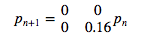
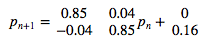
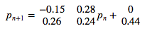
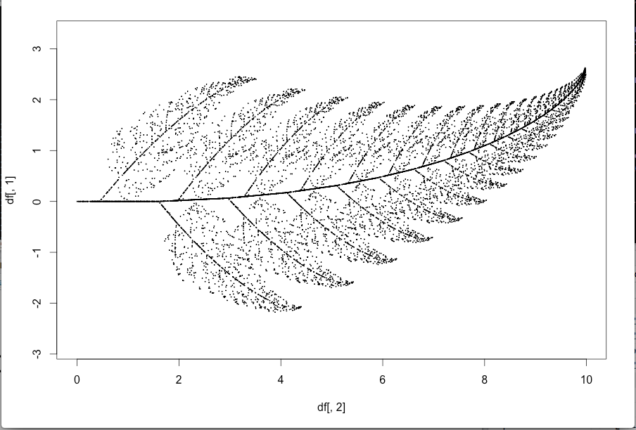
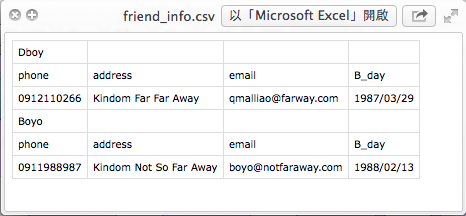

## Before We Start
It is good to have some handy commands at hands.
- rm() / ls()
  - rm(list = ls()): clear all objects in Global Enviroment.
- getwd() / setwd()
- memory.size() / memory.limit(): This is for **Windows user only**.
- ? : The helper function.
- class()
- names()

--- &twocol

## DATA: 一切的起源
*** =left
以資料屬性來分：
- Character (字串)
- Integer (整數)
- Numeric (雙浮點數 / 實數)
- Logical (邏輯值)
- Complex (複數)

*** =right
以資料形態來分：
- 一般變數
- Vector
- Matrix (Array)
- Factor and Data Frame

---

## 基本賦值語法
```{r, results='hold'}
(x <- 'R is easy to learn!')
(y <- 3)
(z <- pi)
(k <- 1 + 2i)
```


---

## Logical

```{r, results='asis'}
bol1 <- T
bol2 <- TRUE
bol3 <- F
bol1 == bol2
bol1 & bol2
bol3 | 4 > 5 
```

---

## Logical (續)

```{r, results='asis'}
4 > 2
1 >= 2
'Dboy' == 'Dboy'
a <- NA
a == NA     # 要用 is.na(a) 才會回傳 TRUE。(另外還有 is.nan)
```

---

## **Funtime**
```{r, results='hold'}
mix_vec1 <- c('a', 2)
mix_vec2 <- c(2, T)
```
猜看看結果會如何?

(c()為 R 中建立向量的內建函式)

> 1. [1] "a" "2"
> 2. [1] 2 1
> 3. Why??

---

## If Loop

### if / else
Syntex:

    if (condition_1){
        #Do something here....
    } else if (conditon_2){
        #Do something here
    } else {
        #Do something here
    }


Note: **else if** and **else** are optional.

---

## If Loop (Cont.)

Exercise:

1. 定義一個變數 value，並隨意給予一個數值。

2. 寫個 if/else if/else 迴圈:

   1. 若 value > 100 或 < -100，執行 print('Extreme')。
   
   2. 若 value <= 60 且 value >= 40，執行 print('Median')。
   
   3. 其餘狀況，執行 print('Normal')

--- 

## Coding Style for If Loop

以下 2 個片段的 code 是等價的，但我們最推薦第一種寫法。

```{r, results = 'hide'}
value <- 5
if (value > 4){
        print('The value is greater than 4')
} else if (2 < value & value <= 4){
        print('The value is greater than 2 and no greater than 4.')
} else {
        print('The value is no greater than 2.')
}
```

---

## Coding Style for Loop (Cont.)

    value <- 5
    {
            if (value > 4)
                    print('The value is greater than 4')
            else if (2 < value & value <= 4)
                    print('The value is greater than 2 and no greater than 4.')
            else
                    print('The value is no greater than 2.')
    }

> 1. 當然，如果你是 Python 的重度愛好者，要寫成這樣我也不反對啦~(攤手)
> 2. 我自己是覺得第一種比較好看!(自以為狀態啟動)
> 3. 特別注意到的是，如果把 { } 去掉，程式會出錯喔!(不一定不能跑，但有可能是錯的)


---

## Vector

- c(): concatenation function

- 範例：

```{r, results = 'hide'}
vec1 <- c(1, 2, 3)
vec2 <- c('a', 'b', 'c')
```

- vector 中所有元素都必須是同一種資料屬性。

- Named Vector:

```{r, results = 'hold'}
Bob <- c(age = 27, height = 187, weight = 80)
Bob
```

---

## Relating Methods (Vector)
- length(): 
  - 語法: **length(my_vec)**
  - 傳回 my_vect 的長度
- +, -, *, /:
  - 語法: **my_vec + other_vec**
  - 注意: R 中所有運算皆向量化。(element by element operation)
- names():
 - 語法: **names(my_vec)**
 - 傳回 my_vec 各維度的名字。
- []:
 - 語法: **my_vec[index]**
 - 傳回 my_vec 的第 index 個元素。


---

## Examples

```{r, results = 'hold'}
vec1 <- c(1, 2, 3)
vec2 <- c(4, 5, 6)
vec1 + vec2
vec1 - vec2
vec1 * vec2
vec1[1] + vec2[3]
```

---

## Examples (Cont.)

```{r, results = 'hold'}
named_vec <- c(age = 27, weight = 80)
names(named_vec)
named_vec['age']   # reference by name.
```


---

## Matrix

- 語法: **matrix(elements, norw, ncol, by.row = T)**
- 例子: 
```{r, results = 'hold'}
My_matrix1 <- matrix(c(1, 2, 3, 4), 2, 2)
My_matrix2 <- matrix(c(1, 2, 3, 4), 2, 2, byrow = T)
My_matrix1
My_matrix2
```

---

## Basic Operations on Matrix

- **+, -, *, /**
- 例子:
```{r}
My_matrix1 + My_matrix2
My_matrix1 * My_matrix2
```

---

## Basic Operation on Matrix (Cont.)

- **%*%**: Matrix Mulplication
- **t()**: Transpose
- 例子:
```{r}
my_vec <- matrix(c(1, 2), ncol = 1) ## 為什麼不用c()?
My_matrix1 %*% my_vec
My_matrix1 %*% t(my_vec)
```

---

## Basic Operation on Matrix (Cont.)

- **dim()**: Dimension
- 例子:
```{r}
dim(My_matrix1)
```

> 1. 記得常常確認矩陣的維度。

> 2. 尤其是在做複雜的模型時，維度是個非常好的指標。

> 3. 譬如說 Neural Network 的 back-propagation。


---

## Factor and Data Frame

- R 中有很多內建資料庫，其中包括你不可以不知道的 iris 資料庫。

- 用法也很簡單，只要輸入以下指令：

```{r, result = 'hide'}
data(iris)
```


1. 可以把 data frame 想像成以 factor 為直欄堆疊起來的資料形態。

2. names(iris) 將可以看到 iris 所有欄位的名字。

3. 我說他是 factor 疊起來的東西你就信了嗎? Try it yourself!

```{r, results = 'hide'}
Species <- iris[, 'Species']
class(Species)                  # R 會告訴你他是個 factor。
Species2 <- as.numeric(Species) # 直接把 factor 轉成 numeric 向量。
Species2
# 你覺得上面這行 code 會跑出什麼呢? 試試看吧!
```

---

## Useful Function for Data Frame

給定一個名叫 data 的 data frame

- names(data): 傳回 data 的所有欄位名稱。

- nrow(data)/ncol(data): 傳回 data 的列 / 行數目。

- head(data, n)/tail(data, n)/View(data)

- which(exp)

- sort/order

- max/min

- rbind/cbind: merge different data frames

---

## Examples: iris

```{r, results = 'hold'}
nrow(iris)    # 顯示 iris 的列數
ncol(iris)    # 顯示 iris 的行數
dim(iris)     # 顯示 iris 的行、列數
names(iris)   # 顯示 iris 的欄位名稱
```

---

## Examples: iris (Cont.)

```{r, results = 'hold'}
head(iris, n = 10)    # 顯示 iris 前 10 筆資料 (預設為 6 筆)
```

---

## Examples: iris (Cont.)

```{r, results = 'hold'}
tail(iris, n = 10)    # 顯示 iris 後 10 筆資料 (預設為 6 筆)
```

---

## Examples: iris (Cont.)

```{r, results = 'hold'}
ind1 <- which(iris[, 'Sepal.Length'] >= 6.5 & iris[, 'Species'] == 'virginica')
class(ind1)
iris1 <- iris[ind1, ]
head(iris1)
```

---

## Examples: iris (Cont.)

```{r, results = 'hold'}
ind2 <- which(iris[, 'Sepal.Length'] < 5.8 & iris[, 'Species'] == 'setosa')
iris2 <- iris[ind2, ]
head(iris2)
```

---

## Examples: iris (Cont.)

```{r, results = 'hold'}
iris3 <- rbind(iris1, iris2)
head(iris3)
```

---

## Examples: iris (Cont.)

```{r, results = 'hold'}
iris4 <- cbind(iris1[1:10, ], iris2[1:10, ])
head(iris4)   # View(iris4)
```

---

## Examples: iris (Cont.)

```{r, results = 'hold'}
sort(iris[1:30, 2])
ind5 <- order(iris[, 'Sepal.Length'], iris[, 'Petal.Length'])
class(ind5)
iris5 <- iris[ind5, ]
```

---

## Examples: iris (Cont.)

```{r, results = 'hold'}
head(iris5)
```

---

## Play With It And You Will Master It!

我們用 cars 資料庫來練習!

```{r, result = 'hide'}
data(cars)
```

Exercises:

> 1. 顯示 cars 前 20 筆資料。
> 2. 將 speed > 19 的資料另外儲存成 car_fast。
> 3. 將 speed < 12 的資料另外儲存成 car_slow。
> 4. 將 car_fast 與 car_slow 合併成 car_extreme。
> 5. 將 car 先依 speed 再依 dist 排序。(Hint: order)


---

## Mini Project: Barnsley Fern Fractal

- 起始點: (0, 0)

- With 5% probability:


- With 81% probability:


- With 7% probability:


- With 7% probability:



---

## Barnsley Fern Fractal

- 依此規則迭代出 10000 點，再把這些點畫成圖。

- 只要用我們有學過的 for 迴圈和矩陣運算就可以做到這件事。

- 你應該會看到:



---

## Mini Project (Barnsley Fern Fractal): Tips

- 可以把迭代出來的點用一個 data.frame 存起來。(例如說存成 coor )

- 最後用 plot(x = coor[, 2], y = coor[, 1], plt = c(0, 10, -5, 5), cex = 0.1, asp = 1) 把它畫出來。

- 這些參數不懂沒關係，它們的唯一功能就只是讓圖變漂亮而已。(很多我也是 Google 來的XD)


---

## Barnsley Fern Fractal程式範例

    iter = 10000
    p = runif(iter)
    coord = matrix(c(0, 0), ncol = 1)
    df = rbind(data.frame(), t(coord))
    for (i in 1:iter) {
            if (p[i] <= 0.05) {
                    m = matrix(c(0, 0, 0, 0.16), nrow = 2, ncol = 2)
                    const = matrix(c(0, 0), ncol = 1)
            } else if (p[i] > 0.05 && p[i] <= 0.86) {
                    m = matrix(c(0.85, -0.04, 0.04, 0.85), nrow = 2, ncol = 2)
                    const = matrix(c(0, 1.6), ncol = 1)
            } else if (p[i] > 0.86 && p[i] <= 0.93) {
                    m = matrix(c(0.2, 0.23, -0.26, 0.22), nrow = 2, ncol = 2)
                    const = matrix(c(0, 1.6), ncol = 1)
                    

---

## Barnsley Fern Fractal程式範例 (續)

            } else {
                    m = matrix(c(-0.15, 0.26, 0.28, 0.24), nrow = 2, ncol = 2)
                    const = matrix(c(0, 0.44), ncol = 1)
            }
            coord = m %*% coord + const
            df = rbind(df, t(coord))
    }

    plot(x = df[, 2], y = df[, 1], plt = c(0, 10, -5, 5), cex = 0.1, asp = 1)


---

## List

- list 是非常方便好用的資料形態。尤其是需儲存不同類型資料的時候，特別好用。

- Vector, Matrix, Data Frame and List.

- 還記得剛剛提過的優先順序嗎？
 - c(1, '2')
 - c(1, T)

- 比較：
 - list(1, '2')
 - list(1, T)

---

## List: Examples

```{r, results='hold'}
mix_list <- list(iris = iris, Bob = c(age=27, weight = 80, heigh = 180) ,cars = cars)
a <- mix_list[c(1, 3)]
class(a)
(b <- mix_list[['Bob']])
class(b)
```


---

## Play With List

```{r, results = 'hold'}
map =list(c('O', 'O', 'O', 'O', 'O'),
          c('O', 'O', 'O', 'O', 'O'),
          c('O', 'O', 'O', 'O', 'O'),
          c('O', 'O', 'O', 'O', 'O'),
          c('O', 'O', 'O', 'O', 'O'))
for (i in 1:length(map)){
        print(map[[i]])
}
```


---

## User-Defined Function
- Syntex:
```{r, results='hide'}
my_function <- function(arg1, arg2, ...){
        # do something here
}
```
- Scoping Rule
 - Local Variable
 - Global Variable

---

## Global v.s. Local

- Example:

```{r, results = 'hide'}
x <- 5
my_fun <- function(){
        x <- 6
        return( x+1 )
}
my_fun()
print(x)
```

- 大家來 Try Try See 吧!

---

## Directory of Friends: friend_info_update

- User what we've learned to build a directory!
 - Define a function called **friend_info_update**.
  - **friend_info_update** takes two arguments: **name_list** and **info_list**.
  - **friend_info_update** will update your friend's information according to 
  **name_list** and **info_list**.
  - **friend_info_update** will output one csv file named **friend_info**

---
## Sample output: 

    name_list <- list('Dboy', 'Boyo')
    info_D <- c(phone = '0912110266', address = 'Kindom Far Far Away',
                email = 'qmalliao@farway.com', B_day= '1987/03/29')
    info_B <- c(phone = '0911988987', address = 'Kindom Not So Far Away',
                email = 'boyo@notfaraway.com', B_day= '1988/02/13')
    info_list <- list(info_D, info_B)
    friend_info_update(name_list, info_list)
    


---

## friend_info_update 程式範例

    friend_info_update <- function(name_list, info_list){
            n_friends <- length(info_list)
            for (i in 1:n_friends){
                    name <- name_list[[i]]
                    info <- matrix(info_list[[i]], nrow = 1,
                                    dimnames = list(NULL, names(info_list[[i]])))
                    info <- as.data.frame(info)
                    write.table(name, 'friend_info.csv', append = T,
                                sep = ',', row.names = F, col.names = F)
                    write.table(info, 'friend_info.csv', append = T,
                                sep = ',', row.names = F, col.names = T)
            }
    }

---

## friend_info_update 程式範例 (續)

    name_list <- list('Dboy', 'Boyo')
    info_D <- c(phone = '0912110266', address = 'Kindom Far Far Away',
    email = 'qmalliao@farway.com', B_day= '1987/03/29')

    info_B <- c(phone = '0911988987', address = 'Kindom Not So Far Away',
    email = 'boyo@notfaraway.com', B_day= '1988/02/13')

    info_list <- list(info_D, info_B)

    friend_info_update(name_list, info_list)


---

## Mini project 2: battleship()

    battleship(10)
    [1] "O" "O" "O" "O" "O"
    [1] "O" "O" "O" "O" "O"
    [1] "O" "O" "O" "O" "O"
    [1] "O" "O" "O" "O" "O"
    [1] "O" "O" "O" "O" "O"
    Guess the x:1
    Guess the y:1
    [1] "X" "O" "O" "O" "O"
    [1] "O" "O" "O" "O" "O"
    [1] "O" "O" "O" "O" "O"
    [1] "O" "O" "O" "O" "O"
    [1] "O" "O" "O" "O" "O"
    [1] "You miss."

---

## Some Function You Might Need

- readline(msg)
```{r, eval=FALSE}
readline('Are you a girl?')
```

- sample.int(x, size)
```{r}
sample.int(5, 1)   # 從 1~5 中隨機抽取 1 個數字。
```

- cat(): 簡單版的 print 。
```{r}
cat('I love R!')
```

---

## Little Game: tips
接下來我們將一步步指導該如何造出這個 battleship()。

- 首先由電腦決定一個座標。

- 定義一個 list 變數 map 如下
```{r, results = 'hide'} 
    map =list(c('O', 'O', 'O', 'O', 'O'),
              c('O', 'O', 'O', 'O', 'O'),
              c('O', 'O', 'O', 'O', 'O'),
              c('O', 'O', 'O', 'O', 'O'),
              c('O', 'O', 'O', 'O', 'O'))
```

-  用一個 for 迴圈把 map 中的每一個項目 print 出來。(看看它會長啥樣子吧!)

- 定義一個變數 tr 並給予初始值 0 。(此變數將用於記錄玩家已經試過幾次)

- 用一個 while 迴圈來判斷 tr 是否超過可嘗試次數。如果沒有，更新 map 並顯示適當訊息。若已超過， break 當前迴圈。


---

## battleship() 成品範例

    battleship <- function(num_guess = 5, cheat = F){
            ship_x <- sample.int(5, size = 1)
            ship_y <- sample.int(5, size = 1)
            if (cheat){
                    print(ship_x)
                    print(ship_y)
            }
            map =list(c('O', 'O', 'O', 'O', 'O'),
                      c('O', 'O', 'O', 'O', 'O'),
                      c('O', 'O', 'O', 'O', 'O'),
                      c('O', 'O', 'O', 'O', 'O'),
                      c('O', 'O', 'O', 'O', 'O'))
            for (r in map){
                    print(r)
            }
            tr <- 0

---

## littel_game() 成品範例 (續)

        while (tr < num_guess){
                    x <- as.numeric(readline('Guess the x:'))
                    y <- as.numeric(readline('Guess the y:'))
                    if (x <= 5 && y <= 5 && x > 0 && y > 0){ 
                            map[[y]][x] <- 'X'
                            for (r in map){
                                    print(r)
                            }
                            if (x == ship_x & y == ship_y){
                                    cat('Oh NO~~~You shrink my boat!!')
                                    break
                            } else{
                                    cat('You miss.')
                                    tr <- tr + 1
                            }

---

## littel_game() 成品範例 (續)

                            if (tr >= num_guess){
                                    cat('You loss.')
                            }
                    } else {
                            cat('Invalid x or y coordinate.')
                    }
            }
        
    }

---

## little_game() mini-project 後小檢討

1. 在開始 coding 之前，最好先用一張小紙條寫好: 我要做什麼?

2. 把大問題拆成小問題逐一解決，再組合起來。
  1. 以 little_game() 來說，它可以先被分解成兩個迴圈。一個 for 迴圈用來於螢幕顯示初始 map 長什麼樣子，一個 while 迴圈用以判斷遊戲是否繼續。
  
  2. 而 while 迴圈又可以進一步分解成兩個部分。第一部分用以於螢幕顯示現在的 map 長什麼樣子，第二部分則會根據玩家輸入的坐標更新 map ，並於螢幕顯示適當訊息。
  
3. 全部組合起來。

4. 新功能: 當新功能進來時，該思考應該在上面的小問題的哪個位置插入適當的程式碼。(判斷玩家重複炸了同一地點?無效的坐標?)

5. 大問題 -> 小問題s -> 大問題
