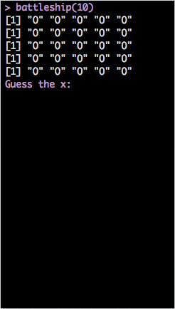
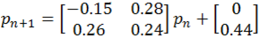

## About This Course

- 我們希望透過直接寫 code 的方式，讓學員可以熟悉 R 的基本操作。

- 除了一些例子跟簡單的習題外，我們另外準備了兩個 mini project 來練習如何綜合所學到的語法。

- Mini Project 1: Barnsley Fern Fractal


--- 

## About This Course (Cont.)

- Mini Project 2: Battleship



---

## Learning Pace

- 如果你沒什麼程式經驗，那可以跟著講解的進度一步一步來。

- 如果你本身已經有一些程式經驗，只是需要練習語法，強烈建議直接跳到後面去。
> 1. 為達到最大的練習量，兩個 mini project 希望都**不要**使用我們提供之模板。
> 2. 如果碰到什麼問題，基本上往前面找應該都能找到需要的方法。
> 3. Go Go Go!!

---

## Before We Start
It is good to have some handy commands at hands.
- getwd() / setwd()
- ? / ??: The helper function. (ex: ?getwd)

--- .segue bg:navy

## Data: Where the Story Begins

--- &twocol

## DATA: 一切的起源
*** =left
以資料屬性來分：
- Character (字串)
- Integer (整數)
- Numeric (雙浮點數 / 實數)
- Logical (邏輯值)
- Complex (複數)

*** =right
以資料形態來分：
- 一般變數
- Vector
- Matrix (Array)
- Factor and Data Frame

---

## 基本賦值語法
```{r, results='hold'}
(x <- 'R is easy to learn!')
(y <- 3)
(z <- pi)
(k <- 1 + 2i)
```


--- .segue bg:green

## Logical


---

## Logical

```{r, results='asis'}
bol1 <- T
bol2 <- TRUE
bol3 <- F
bol1 == bol2
bol1 & bol2
bol3 | 4 > 5 
```

---

## Logical (續)

```{r, results='asis'}
4 > 2
1 >= 2
'Dboy' == 'Dboy'
a <- NA
a == NA     # 要用 is.na(a) 才會回傳 TRUE。(另外還有 is.nan)
```


---

## Fun Time

### 於 Console 中依續執行下列程式碼。

1. my_vec <- c(1, 2, 5, 90, 37)
2. ind <- my_vec >= 5
3. sum(ind) 


---

## Fun Time

### 於 Console 中依續執行下列程式碼。

1. my_vec <- c(1, 2, 5, 90, 37)
2. ind <- my_vec >= 5
3. sum(my_vec) 

`猜猜看答案會是多少? (sum 是 R 中的內建函式，用以求和。)`


--- .segue bg:navy

## Loops

--- .segue bg:green

## If Loop

---

## If Loop

### if / else
Syntex:

    if (condition_1){
        #Do something here....
    } else if (conditon_2){
        #Do something here
    } else {
        #Do something here
    }


Note: **else if** and **else** are optional.

---

## If Loop (Cont.)

Exercise:

1. 定義一個變數 value，並隨意給予一個數值。

2. 寫個 **if**/**else if**/**else** 迴圈:

   1. 若 value > 100 或 < -100，執行 print('Extreme')。
   
   2. 若 value <= 60 且 value >= 40，執行 print('Median')。
   
   3. 其餘狀況，執行 print('Normal')

--- .segue bg:green

## For Loop

---

## For Loop

### Syntex:

    for (iterator){
        #Do something here....
    } 

### Example: 土炮 sum()

```{r, results='hold'}
# 從 1 加到 10
final_result <- 0
for (i in 1:10){
        final_result <- final_result + i
}
(final_result)
```

--- .segue bg:green

## While Loop

---

## While Loop

### Syntex:

    while (condition_1){
        #Do something here....
    } 

### Example:


    while (T){
            handsome <- readline('Are you handsome? ')
            if (handsome == 'yes'){
                    print('Really....!?')
            } else {
                    print('Now we are talking.')
                    break
            }
    }


---

## While Loop (Cont.)


---

## While Loop (Cont.)


### Exercise

> 1. 那如果要把上述程式改成電腦不斷詢問 "Do you like to code?" 呢?
> 2. 至於要回答 'yes' or 'no' 才會停....


--- .segue bg:navy

## Vector, List, Factor, Data Frame and Matrix


--- .segue bg:green

## Vector

---

## Vector

- c(): concatenation function

- 範例：

```{r, results = 'hide'}
vec1 <- c(1, 2, 3)
vec2 <- c('a', 'b', 'c')
```

- vector 中所有元素都必須是同一種資料屬性。

- Named Vector:

```{r, results = 'hold'}
Bob <- c(age = 27, height = 187, weight = 80)
Bob
```

---

## **Funtime**
```{r, results='hold'}
mix_vec1 <- c('a', 2)
mix_vec2 <- c(2, T)
```
猜看看結果會如何?

> 1. [1] "a" "2"
> 2. [1] 2 1
> 3. Why??


---

## Useful Methods (Vector)
- length(): 
  - 語法: **length(my_vec)**
  - 傳回 my_vect 的長度
- +, -, *, /:
  - 語法: **my_vec + other_vec**
  - 注意: R 中所有運算皆向量化。(element by element operation)
- names():
 - 語法: **names(my_vec)**
 - 傳回 my_vec 各維度的名字。
- []:
 - 語法: **my_vec[index]**
 - 傳回 my_vec 的第 index 個元素。


---

## Examples

```{r, results = 'hold'}
vec1 <- c(1, 2, 3)
vec2 <- c(4, 5, 6)
vec1 + vec2
vec1 - vec2
vec1 * vec2
vec1[1] + vec2[3]
```

---

## Examples (Cont.)

```{r, results = 'hold'}
names(Bob)
Bob['age']   # reference by name.
```

---

## Exercise

定義一個向量 me 記錄自己的身高(公分)、體重(公斤)與年齡。

---

## Exercise

定義一個向量 me 記錄自己的身高(公分)、體重(公斤)與年齡。

`如果我還想記錄頭髮的顏色跟電話號碼呢?`

> 1. 把 hair_color='Black' 存進去?
> 2. 如果電話是 +886 911333966 呢?


--- .segue bg:green

## List

---

## List

- list 是非常方便好用的資料形態。尤其是需儲存不同類型資料的時候，特別好用。

- Vector, Matrix, Data Frame and List.

- 還記得剛剛提過的優先順序嗎？
 - c(1, '2')
 - c(1, T)

- 比較：
 - list(1, '2')
 - list(1, T)

---

## List: Examples

```{r, results='hold'}
Bob <- list(age=27, weight = 80,
            favorite_data_name = 'iris', favorite_data = iris)
(age1 <- Bob[1])
class(age1)
(age2 <- Bob[[1]])
class(age2)
```

---

## List: Examples (Cont.)

```{r, results='hold'}
(Age_and_DataName <- Bob[c(1, 3)])
head(Bob[['favorite_data']])
```


---

## Play With List

### `Warmup for Battleship Mini Project: Drawing the Map`

```{r, results = 'hold'}
map =list(c('O', 'O', 'O', 'O', 'O'),
          c('O', 'O', 'O', 'O', 'O'),
          c('O', 'O', 'O', 'O', 'O'),
          c('O', 'O', 'O', 'O', 'O'),
          c('O', 'O', 'O', 'O', 'O'))
for (i in 1:length(map)){
        print(map[[i]])
}
```

--- .segue bg:green

## Factor and Data Frame


---

## Factor and Data Frame

- R 中有很多內建資料庫，其中包括你不可以不知道的 iris 資料庫。

- 用法也很簡單，只要輸入以下指令：

```{r, result = 'hold'}
data(iris)
head(iris)
```

---

## Factor and Data Frame (Cont.)

1. names(iris) 將可以看到 iris 所有欄位的名字。

2. 關於 factor ，我們來看看下面這個例子。

```{r, results = 'hide'}
Species <- iris[, 'Species']
class(Species)                  # R 會告訴你他是個 factor。
Species2 <- as.numeric(Species) # 直接把 factor 轉成 numeric 向量。
Species2
# 你覺得上面這行 code 會跑出什麼呢? 試試看吧!
```

---

## Useful Functions for Data Frame

給定一個名叫 data 的 data frame

- names(data): 傳回 data 的所有欄位名稱。

- nrow(data)/ncol(data): 傳回 data 的列 / 行數目。

- head(data, n)/tail(data, n)/View(data)

- which(exp)

- sort/order

- max/min

- rbind/cbind: merge different data frames

---

## Examples: iris

```{r, results = 'hold'}
nrow(iris)    # 顯示 iris 的列數
ncol(iris)    # 顯示 iris 的行數
dim(iris)     # 顯示 iris 的行、列數
names(iris)   # 顯示 iris 的欄位名稱
```

---

## Examples: iris (Cont.)

```{r, results = 'hold'}
head(iris, n = 10)    # 顯示 iris 前 10 筆資料 (預設為 6 筆)
```

---

## Examples: iris (Cont.)

```{r, results = 'hold'}
tail(iris, n = 10)    # 顯示 iris 後 10 筆資料 (預設為 6 筆)
```

---

## Examples: iris (Cont.)

```{r, results = 'hold'}
ind1 <- which(iris[, 'Sepal.Length'] >= 6.5 & iris[, 'Species'] == 'virginica')
class(ind1)
iris1 <- iris[ind1, ]
head(iris1)
```

---

## Examples: iris (Cont.)

```{r, results = 'hold'}
ind2 <- which(iris[, 'Sepal.Length'] < 5.8 & iris[, 'Species'] == 'setosa')
iris2 <- iris[ind2, ]
head(iris2)
```

---

## Examples: iris (Cont.)

```{r, results = 'hold'}
iris3 <- rbind(iris1, iris2)
head(iris3)
```

---

## Examples: iris (Cont.)

```{r, results = 'hold'}
iris4 <- cbind(iris1[1:10, ], iris2[1:10, ])
head(iris4)   # View(iris4)
```

---

## Examples: iris (Cont.)

```{r, results = 'hold'}
sort(iris[1:30, 2])
ind5 <- order(iris[, 'Sepal.Length'], iris[, 'Petal.Length'])
ind5[1:20]
class(ind5)
iris5 <- iris[ind5, ]
```

---

## Examples: iris (Cont.)

```{r, results = 'hold'}
head(iris5)
```

---

## Examples: iris (Cont.)

我們也可以改變欄位的名字。

```{r, results = 'hold'}
iris6 <- iris
colnames(iris6) <- c('SLength', 'SWidth', 'PLength', 'PWidth', 'Sp')
# 也可以用 names(iris6) <- c('SLength', 'SWidth', 'PLength', 'PWidth', 'Sp')
head(iris6)
```


---

## Play With It And You Will Master It!

我們用房貸餘額資料來練習!

`之後會在 ETL 課程再度碰到它，也會學到進階的資料處理技巧。`


---

## Play With It And You Will Master It!

我們用房貸餘額資料來練習!

`之後會在 ETL 課程再度碰到它，也會學到進階的資料處理技巧。`

到[這裡](https://raw.githubusercontent.com/ntuaha/TWFS/master/db/cl_info_other.csv)下載檔案。(cl_info_other.csv)


---

## Play With It And You Will Master It!


```{r, result = 'hide'}
# read.table 小技巧。
tmp <- read.table('./cl_info_other.csv', sep = ',',
                 stringsAsFactors = F, header = T, nrows = 1000)
colClasses <- sapply(tmp, class)
DF <- read.table('./cl_info_other.csv', sep = ',',
                 header = T, colClasses = colClasses)
```


---

## Play With It And You Will Master It!


```{r, result = 'hide'}
# read.table 小技巧。
tmp <- read.table('./cl_info_other.csv', sep = ',',
                 stringsAsFactors = F, header = T, nrows = 1000)
colClasses <- sapply(tmp, class)
DF <- read.table('./cl_info_other.csv', sep = ',',
                 header = T, colClasses = colClasses)
```


---

## Play With It And You Will Master It!

`Exercises`:

1. 顯示 DF 前 20 筆資料與所有欄位的名稱。
3. 將 mortgage_cnt < 2053 的資料另外儲存成 banks_below。
4. 將 mortgage_cnt >= 22538 的資料另外儲存成 banks_above。
5. 將 banks_below 與 banks_above 合併。
6. 將 DF 先依 mortgage_cnt 再依 mortgage_bal 排序。(Hint: order)

--- .segue bg:green

## Matrix

---

## Matrix

- 語法: **matrix(elements, norw, ncol, byrow = F)**
- 例子: 
```{r, results = 'hold'}
My_matrix1 <- matrix(1:6, 2, 3)
My_matrix2 <- matrix(1:6, 2, 3, byrow = T)
My_matrix1
My_matrix2
```

---

## Basic Operations on Matrix

- **+, -, *, /**
- 例子:
```{r, results='hold'}
My_matrix1 + My_matrix2
My_matrix1 * My_matrix2
```

---

## Basic Operation on Matrix (Cont.)

- **%*%**: Matrix Mulplication
- **t()**: Transpose
- 例子:
```{r, results='hold'}
vec <- c(1:3)
(t(vec))
```

---

## Basic Operation on Matrix (Cont.)

- **%*%**: Matrix Mulplication
- **t()**: Transpose
- 例子:


```{r}
my_vec <- matrix(1:3, ncol = 1) # 用 c() 也跑得動。
My_matrix1 %*% my_vec
My_matrix1 %*% t(my_vec)
```


---

## Basic Operation on Matrix (Cont.)

- **my_matrix[row_index, col_index]**
- 例子:
```{r}
My_matrix1[1, c(1, 3)]
My_matrix2[, c(2, 3)]
```

---

## Basic Operation on Matrix (Cont.)

- **dim()**: Dimension
- 例子:
```{r}
dim(My_matrix1)
```

> 1. 記得常常確認矩陣的維度。

> 2. 尤其是在做複雜的模型時，維度是個非常好的指標。

> 3. It's time for mini project!


--- .segue bg:navy

## Mini Project 1: Barnsley Fern Fractal

---

## Mini Project 1: Barnsley Fern Fractal

- 起始點:


- With 5% probability:


- With 81% probability:


- With 7% probability:


- With 7% probability:



---

## Barnsley Fern Fractal

- 依此規則迭代出 10000 點，再把這些點畫成圖。

- 只要用我們有學過的 **for**/**if** 迴圈和矩陣運算就可以做到這件事。

- 你應該會看到:


---

## Barnsley Fern Fractal: Tips

- 可以把迭代出來的點用一個 data.frame 存起來。(例如說存成 coor )

- 最後用 plot(x = coor[, 2], y = coor[, 1], plt = c(0, 10, -5, 5), cex = 0.1, asp = 1) 把它畫出來。

- 這些參數不懂沒關係，它們的唯一功能就只是讓圖變漂亮而已。(很多我也是 Google 來的XD)

---

## Barnsley Fern Fractal: Tips

- 可以把迭代出來的點用一個 data.frame 存起來。(例如說存成 coor )

- 最後用 plot(x = coor[, 2], y = coor[, 1], plt = c(0, 10, -5, 5), cex = 0.1, asp = 1) 把它畫出來。

- 這些參數不懂沒關係，它們的唯一功能就只是讓圖變漂亮而已。(很多我也是 Google 來的XD)

- [Template](https://dl.dropboxusercontent.com/u/5487490/RBasic/Barnsley_Fern_template.R)


---

## Barnsley Fern Fractal: Tips

- 可以把迭代出來的點用一個 data.frame 存起來。(例如說存成 coor )

- 最後用 plot(x = coor[, 2], y = coor[, 1], plt = c(0, 10, -5, 5), cex = 0.1, asp = 1) 把它畫出來。

- 這些參數不懂沒關係，它們的唯一功能就只是讓圖變漂亮而已。(很多我也是 Google 來的XD)

- [Template](https://dl.dropboxusercontent.com/u/5487490/RBasic/Barnsley_Fern_template.R)

- `敬請期待 Data Visualization 教學課程。`


---

## Barnsley Fern Fractal 程式範例

    rm(list = ls())
    iter = 10000
    p = runif(iter)
    coord = matrix(c(0, 0), ncol = 1)
    df = rbind(data.frame(), t(coord))
    for (i in 1:iter) {
            if (p[i] <= 0.05) {
                    m = matrix(c(0, 0, 0, 0.16), nrow = 2, ncol = 2)
                    const = matrix(c(0, 0), ncol = 1)
            } else if (p[i] > 0.05 && p[i] <= 0.86) {
                    m = matrix(c(0.85, -0.04, 0.04, 0.85), nrow = 2, ncol = 2)
                    const = matrix(c(0, 1.6), ncol = 1)
            } else if (p[i] > 0.86 && p[i] <= 0.93) {
                    m = matrix(c(0.2, 0.23, -0.26, 0.22), nrow = 2, ncol = 2)
                    const = matrix(c(0, 1.6), ncol = 1)
                    

---

## Barnsley Fern Fractal程式範例 (續)

            } else {
                    m = matrix(c(-0.15, 0.26, 0.28, 0.24), nrow = 2, ncol = 2)
                    const = matrix(c(0, 0.44), ncol = 1)
            }
            coord = m %*% coord + const
            df = rbind(df, t(coord))
    }

    plot(x = df[, 2], y = df[, 1], plt = c(0, 10, -5, 5), cex = 0.1, asp = 1)


--- .segue bg:navy

## User-Defined Function

---

## User-Defined Function

### `Syntex`


    my_function <- function(arg1, arg2 = arg2_default, ...){
            # do something here
            
            # return the result. (optional)
    }


> 1. 如果在最後沒有 return() ，R 會自動回傳**最後一次運算**的結果。
> 2. 強烈建議習慣性寫上 return()。

---

## User-Defined Function (Cont.)

### Example

`把剛剛土炮的 sum 包起來!`

```{r}
my_sum <- function(lst){
        final_result <- 0
        for (num in lst){
                final_result <- final_result + num
                }
        return(final_result)
}
numbers <- c(1, 2, 5 ,6, 8, 33)
my_sum(numbers)
```

---

## One Last Thing: Global v.s. Local

- Example:

```{r, results = 'hide'}
x <- 5
my_fun <- function(){
        x <- 6
        return( x+1 )
}
my_fun()
print(x)
```

- 大家來 Try Try See 吧!


--- .segue bg:navy

## Mini project 2: Battleship


---

## Mini project 2: Battleship


---

## Battleship: Tips
`接下來我們將一步步指導該如何造出這個 battleship()。`

- 首先由電腦決定一個座標。

- 定義一個 list 變數 map 如下
```{r, results = 'hide'} 
map =list(c('O', 'O', 'O', 'O', 'O'),
          c('O', 'O', 'O', 'O', 'O'),
          c('O', 'O', 'O', 'O', 'O'),
          c('O', 'O', 'O', 'O', 'O'),
          c('O', 'O', 'O', 'O', 'O'))
```

-  用一個 for 迴圈把 map 中的每一個項目 print 出來。

- 定義一個變數 trial 並給予初始值 0 。(此變數將用於記錄玩家已經試過幾次)

- 用一個 while 迴圈來判斷 trial 是否超過可嘗試次數。如果沒有，更新 map 並顯示適當訊息。若已超過， break 當前迴圈。


---

## Battleship: Tips

- [Template](https://dl.dropboxusercontent.com/u/5487490/RBasic/battleship_template.R)


---

## Some Function You Might Need

- readline(msg)
```{r, eval=FALSE}
readline('Are you a girl?') # readline() 會把輸入的資料存成字串。
```

- sample.int(x, size)
```{r}
sample.int(5, 1)   # 從 1~5 中隨機抽取 1 個數字。
```

- cat(): 簡單版的 print 。
```{r}
cat('I love R!')
```

---

## Battleship 成品範例

    battleship <- function(num_guess = 5, cheat = F){
            ship_x <- sample.int(5, size = 1)
            ship_y <- sample.int(5, size = 1)
            if (cheat){
                    print(ship_x)
                    print(ship_y)
            }
            map =list(c('O', 'O', 'O', 'O', 'O'),
                      c('O', 'O', 'O', 'O', 'O'),
                      c('O', 'O', 'O', 'O', 'O'),
                      c('O', 'O', 'O', 'O', 'O'),
                      c('O', 'O', 'O', 'O', 'O'))
            for (r in map){
                    print(r)
            }
            trial <- 0

---

## Battleship 成品範例 (續)

        while (trial < num_guess){
                    x <- as.numeric(readline('Guess the x:'))
                    y <- as.numeric(readline('Guess the y:'))
                    if (x <= 5 && y <= 5 && x > 0 && y > 0){ 
                            map[[y]][x] <- 'X'
                            for (r in map){
                                    print(r)
                            }
                            if (x == ship_x & y == ship_y){
                                    cat('Oh NO~~~You shrink my boat!!')
                                    break
                            } else{
                                    cat('You miss.')
                                    trial <- trial + 1
                            }

---

## Battleship 成品範例 (續)

                            if (trial >= num_guess){
                                    cat('You loss.')
                            }
                    } else {
                            cat('Invalid x or y coordinate.')
                    }
            }
        
    }


--- .segue bg:navy

## Power up your R!


---

## Packages

- R 是一個 open source 的程式語言。
- 有許多人開發許多功能強大的套件。
- 使用這些套件可以擴充 R 的功能性。(這個投影片也是用 R 做的)
- 在這一個章節將介紹如何安裝這些套件。(以接下來 ETL 課程將會用到的 dplyr 套件安裝為例)


---

## install.packages

        # 安裝 'dplyr' 套件
        install.packages('dplyr')
        # 匯入相關函式 。
        library('dplyr')
        

---

## install.packages

        # 安裝 'dplyr' 套件
        install.packages('dplyr')
        # 匯入相關函式 。
        library('dplyr')

`Excercise`

1. 安裝 xts, gdata 套件。
2. 匯入 xts, gdata 套件。


--- .segue bg:orange

## Thanks for Your Attention!

